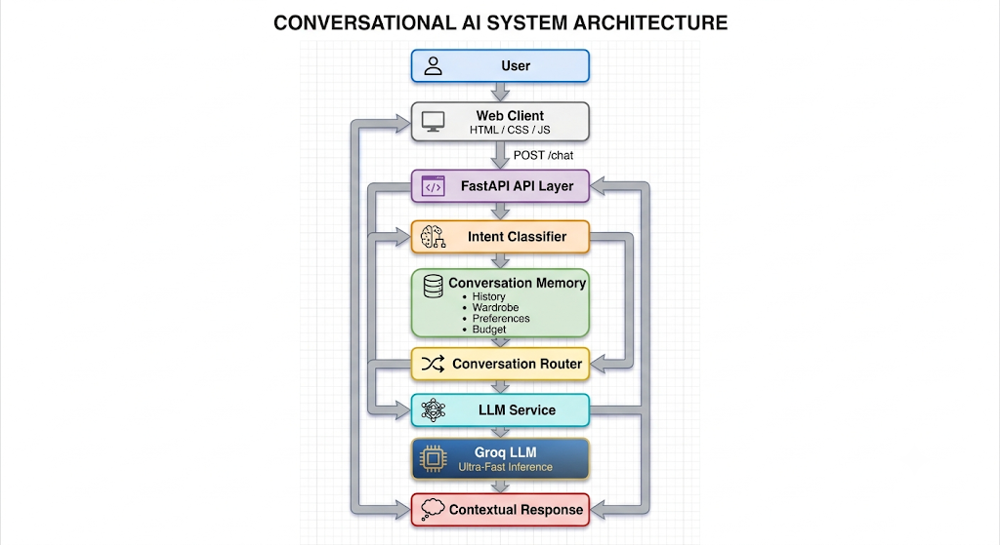

Bilkul. Is baar README ko **portfolio-project wali generic README** nahi rakhenge. It should read like an actual engineering project: clear product positioning, architecture, design decisions, API, testing, configuration, limitations, and roadmap. GitHub itself recommends README content that explains what the project does, why it is useful, and how to get started; Google similarly emphasizes purpose, usage, status, and reproducible commands. ([GitHub Docs][1])

**Important:** main sirf wahi claims rakh raha hoon jo tumhare current project mein actually implemented hain—fake production claims, fake metrics, fake deployment, etc. nahi.

Tumhari root directory mein **`README.md`** banao aur ye complete content paste karo:

````markdown
# Mr.Shop

### Context-Aware Conversational AI for Fashion & Shopping

Mr.Shop is a conversational AI prototype that combines intent classification,
session-level memory, contextual routing, and a Groq-powered LLM to provide
personalized fashion and shopping assistance.

Instead of treating every message as an isolated request, Mr.Shop maintains
relevant conversation context such as wardrobe items, color preferences, and
budget while allowing users to switch naturally between styling, shopping,
wardrobe, and consultation-related tasks.

---

## Overview

Traditional chatbot flows often process each user message independently.
That creates a poor experience when a conversation evolves over multiple
turns.

Mr.Shop is designed around a different approach:

> **Understand the user's intent, retain relevant context, and generate the
> next response using the current conversational state.**

For example:

```text
User:
I have black jeans.

Mr.Shop:
[Stores jeans in wardrobe]
[Stores black as a color preference]

User:
What should I wear with them?

Mr.Shop:
Uses the existing conversation context to continue the styling discussion.

User:
Recommend white sneakers under 3000.

Mr.Shop:
Switches from styling to purchase intent while retaining the previous
conversation state.
````

---

## Product Capabilities

### Intent Understanding

Mr.Shop currently supports four conversational intents:

| Intent            | Purpose                                          |
| ----------------- | ------------------------------------------------ |
| `WARDROBE_UPLOAD` | Add clothing-related information to the wardrobe |
| `STYLING_ADVICE`  | Get outfit and styling guidance                  |
| `PURCHASE`        | Request product recommendations                  |
| `BOOKING`         | Request stylist or consultation assistance       |

---

### Contextual Memory

The conversation layer maintains session-level state including:

* Conversation history
* Wardrobe items
* Color preferences
* Budget information

Example:

```text
"I have black jeans"
```

can update the conversational state with:

```json
{
  "preferences": {
    "color": "black"
  },
  "wardrobe": [
    "jeans"
  ]
}
```

A later message can continue using the accumulated state instead of starting
from zero.

---

### Topic Switching

Users are not restricted to a single conversation intent.

For example:

```text
STYLING_ADVICE
       ↓
PURCHASE
       ↓
BOOKING
```

The intent of a new message is classified independently while relevant
session context remains available.

---

### LLM-Powered Responses

Groq is used as the LLM layer for generating conversational responses.

The architecture separates the LLM service from the rest of the application,
making the provider layer replaceable without redesigning the entire
conversation architecture.

---

### Professional Web Interface

Mr.Shop includes a responsive conversational interface with:

* Conversation sidebar
* New conversation control
* Chat interface
* Suggested actions
* Message states
* Typing indicator
* Context panel
* Current intent display
* Wardrobe state
* Budget state
* Preference state
* Session memory indicator
* Responsive mobile layout

---

# Architecture



---

# Request Lifecycle

A typical `/chat` request follows this pipeline:

```text
1. User sends message
        ↓
2. FastAPI receives request
        ↓
3. Intent is classified
        ↓
4. Conversation memory is updated
        ↓
5. Current context is retrieved
        ↓
6. Conversation router determines response flow
        ↓
7. LLM service generates the response
        ↓
8. API returns response + intent + context
        ↓
9. Frontend updates chat and context panel
```

This separation keeps individual responsibilities isolated and makes the
system easier to test and extend.

---

# Project Structure

```text
mr-shop/
│
├── app/
│   ├── classifier.py
│   ├── llm.py
│   ├── main.py
│   ├── memory.py
│   ├── models.py
│   └── router.py
│
├── static/
│   ├── index.html
│   ├── style.css
│   └── script.js
│
├── data/
│   └── sample_users.json
│
├── tests/
│   ├── test_classifier.py
│   ├── test_memory.py
│   ├── test_router.py
│   └── test_conversations.py
│
├── .env
├── .gitignore
├── requirements.txt
└── README.md
```

---

# Core Components

## `classifier.py`

Responsible for determining the user's current conversational intent.

```text
User message
     ↓
Intent classification
     ↓
WARDROBE_UPLOAD
STYLING_ADVICE
PURCHASE
BOOKING
```

---

## `memory.py`

Maintains the session-level conversational state.

Current state includes:

```python
{
    "preferences": {},
    "wardrobe": [],
    "budget": None,
    "conversation_history": []
}
```

The memory layer also extracts relevant information from incoming messages.

---

## `router.py`

Acts as the orchestration layer.

Responsibilities include:

* Running intent classification
* Updating memory
* Retrieving context
* Selecting the response flow
* Returning structured conversational output

This prevents business logic from being tightly coupled to the API layer.

---

## `llm.py`

Provides the LLM integration.

The LLM provider is isolated behind a dedicated service layer so that
provider-specific implementation does not leak into the rest of the
application.

Current provider:

```text
Groq
```

---

## `main.py`

Defines the FastAPI application and exposes the HTTP interface.

Current endpoints:

```text
GET  /
POST /chat
```

---

## `models.py`

Contains the request and response models used by the API.

This keeps the API contract explicit and provides validation at the
application boundary.

---

# API

## Health / Root Endpoint

```http
GET /
```

Example response:

```json
{
  "message": "Mr.Shop Conversation Layer is running"
}
```

---

## Chat Endpoint

```http
POST /chat
```

### Request

```json
{
  "message": "I have black jeans. Suggest an outfit."
}
```

### Response

```json
{
  "intent": "STYLING_ADVICE",
  "response": "Based on your wardrobe, I can suggest an outfit for you.",
  "context": {
    "preferences": {
      "color": "black"
    },
    "wardrobe": [
      "jeans"
    ],
    "budget": null,
    "conversation_history": []
  }
}
```

The exact response content depends on the current conversation state and
LLM output.

---

# Getting Started

## Prerequisites

Make sure the following are installed:

* Python 3.10+
* pip
* Git
* A Groq API key

---

## 1. Clone the Repository

```bash
git clone <YOUR_REPOSITORY_URL>
cd mr-shop
```

---

## 2. Create a Virtual Environment

### Windows

```bash
python -m venv venv
venv\Scripts\activate
```

### macOS / Linux

```bash
python3 -m venv venv
source venv/bin/activate
```

---

## 3. Install Dependencies

```bash
pip install -r requirements.txt
```

---

## 4. Configure Environment Variables

Create a `.env` file in the project root:

```env
GROQ_API_KEY=your_groq_api_key
```

### Security

Never commit `.env` or API keys to source control.

Add the following to `.gitignore`:

```text
.env
venv/
__pycache__/
.pytest_cache/
```

---

# Running the Application

Start the FastAPI development server:

```bash
uvicorn app.main:app --reload
```

The application will be available at:

```text
http://127.0.0.1:8000
```

Open the application in your browser:

```text
http://127.0.0.1:8000
```

FastAPI's interactive API documentation is available at:

```text
http://127.0.0.1:8000/docs
```

---

# Testing

The project includes automated tests covering the main conversation
components.

Run:

```bash
python -m pytest
```

Current test suite:

```text
11 passed
```

The tests cover areas including:

* Intent classification
* Conversation memory
* Router behavior
* Multi-turn conversation flows

---

# Example Conversation

### 1. Establish Context

```text
User:
I have black jeans.
```

The system can retain:

```text
Wardrobe → jeans
Color → black
```

---

### 2. Continue the Conversation

```text
User:
What should I wear with them?
```

The conversation continues with the previously established context.

---

### 3. Switch Intent

```text
User:
Recommend white sneakers under 3000.
```

The system can transition to:

```text
PURCHASE
```

while retaining relevant session information.

---

### 4. Consultation

```text
User:
I want to book a stylist consultation.
```

The system transitions to:

```text
BOOKING
```

without requiring the user to restart the conversation.

---

# Design Decisions

## Separation of Concerns

The application separates:

```text
Classification
     ↓
Memory
     ↓
Routing
     ↓
LLM
     ↓
API
     ↓
Frontend
```

Each component has a focused responsibility.

This makes individual components easier to test and allows future changes
without rewriting the entire application.

---

## Session-Level Memory

The prototype uses in-memory conversational state.

This keeps the implementation simple and makes the behavior easy to inspect
during development.

For a production system, this layer could be replaced with a persistent
storage solution without changing the overall conversation architecture.

---

## Provider Abstraction

The LLM integration is isolated inside the LLM service.

Therefore, changing the model provider should primarily affect the service
layer rather than the classifier, memory, router, or API design.

---

# Current Scope

Mr.Shop is currently a conversational AI prototype.

Implemented:

* Intent classification
* Four supported intents
* Session-level memory
* Wardrobe tracking
* Color preference extraction
* Budget extraction
* Topic switching
* Groq LLM integration
* FastAPI backend
* Responsive web interface
* Automated tests

---

# Current Limitations

The current implementation intentionally keeps the prototype lightweight.

### Memory

Conversation memory is session-based and stored in application memory.
It is not yet backed by a persistent database.

### Context Extraction

Wardrobe, color, and budget extraction currently use lightweight
rule-based extraction rather than a dedicated entity extraction model.

### Product Search

The current `PURCHASE` flow provides recommendation-oriented responses;
it does not yet connect to a live product catalog or commerce API.

### Booking

The `BOOKING` flow currently provides consultation assistance but does not
yet integrate with a real scheduling or calendar system.

### Authentication

User authentication and account-level persistent profiles are outside the
current prototype scope.

---

# Roadmap

The architecture is intentionally designed to support future extensions.

### Phase 1 — Core Conversation

* [x] Intent classification
* [x] Conversation memory
* [x] Context-aware routing
* [x] Groq integration
* [x] FastAPI API
* [x] Web interface
* [x] Automated tests

### Phase 2 — Smarter Context

* [ ] Structured entity extraction
* [ ] More granular wardrobe attributes
* [ ] Persistent user profiles
* [ ] Conversation summarization
* [ ] Improved context selection

### Phase 3 — Shopping Intelligence

* [ ] Product catalog integration
* [ ] Product filtering
* [ ] Budget-aware ranking
* [ ] Recommendation explanations
* [ ] Product availability checks

### Phase 4 — Personalization

* [ ] User accounts
* [ ] Persistent wardrobe
* [ ] Style profiles
* [ ] Long-term preferences
* [ ] Personalized recommendations

### Phase 5 — Production Infrastructure

* [ ] Persistent database
* [ ] Authentication
* [ ] Observability
* [ ] Rate limiting
* [ ] Background jobs
* [ ] Production deployment
* [ ] CI/CD pipeline

---

# Engineering Principles

Mr.Shop follows a few core engineering principles:

**Modularity**

Each major responsibility lives behind a focused component.

**Testability**

Core conversation behavior is covered by automated tests.

**Replaceability**

The LLM provider is isolated from the rest of the application.

**Context Awareness**

Conversation state is treated as a first-class part of the response pipeline.

**Incremental Architecture**

The prototype can evolve toward persistent storage, richer retrieval,
product integrations, and production infrastructure without requiring a
complete rewrite.

---

# Technology Stack

| Layer           | Technology                |
| --------------- | ------------------------- |
| Frontend        | HTML, CSS, JavaScript     |
| Backend         | FastAPI                   |
| Language        | Python                    |
| LLM             | Groq                      |
| API             | REST                      |
| Validation      | Pydantic / FastAPI models |
| Testing         | Pytest                    |
| Version Control | Git                       |

---

# Security Notes

* API credentials are loaded through environment variables.
* Secrets should never be committed to Git.
* `.env` should remain excluded from version control.
* Production deployments should add authentication, rate limiting,
  secret management, logging, and monitoring.

---

# Project Status

**Status:** Active Prototype

Mr.Shop currently focuses on the conversational intelligence layer and
context-aware interaction model.

The project is structured so that additional AI capabilities and external
services can be introduced incrementally.

---

# License

This project is currently intended as a portfolio / prototype project.

If this repository is released publicly, add an explicit license such as
MIT before distributing it as open-source software.

---

## Author

**Tushar Verma**


